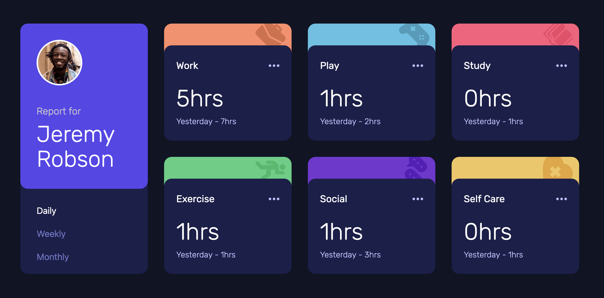

# Frontend Mentor - Time tracking dashboard solution

This is a solution to the [Time tracking dashboard challenge on Frontend Mentor](https://www.frontendmentor.io/challenges/time-tracking-dashboard-UIQ7167Jw). Frontend Mentor challenges help you improve your coding skills by building realistic projects.

## Overview

### The challenge

Users should be able to:

- View the optimal layout for the site depending on their device's screen size
- See hover states for all interactive elements on the page
- Switch between viewing Daily, Weekly, and Monthly stats

### Screenshot



### Links

- Solution URL: [Solution repo](https://github.com/norwegJan/Time-Tracking-Dashboard)
- Live Site URL: [Live site](https://norwegjan.github.io/Time-Tracking-Dashboard/)

## My process

### Built with

- Semantic HTML5 markup
- CSS custom properties
- Flexbox
- CSS Grid
- Mobile-first workflow
- Custom JavaScript

### What I learned

The main focus of this challenge was to learn how to work with a data.json file, how to use the fetch api to parse/extract the data within, and then how to dynamically update the UI on the live page with the data. And though I'm beginning to understand the underlying concepts how all this work, I have to admit: I'm still struggling with this.

I managed to research my way and figure out how to parse the data, and then console.log it with:

```
fetch("./data.json")
  .then((response) => {
    if (!response.ok) {
      throw new Error(`HTTP error! Status: ${response.status}`);
    }
    return response.json();
  })
  .then((data) => {
    activities = data;
    console.log(activities);
  })
  .catch((error) => {
    console.error("Fetch error:", error);
  });
```

But after this I kinda blanked out and didn't manage to figure out how I was supposed to get the data out to the live page (the DOM). So here I admit I had to resort to ChatGPT to provide me with suggestions on how to proceed. It suggested several codeblocks I'm yet to fully understand, so I have to spend some time to research these further and process these in the tempo it takes.

On the layout-side I ended up struggling a LOT with the swap from mobile/tablet-grids to the desktop-grid. So I ended up spending a good ampount of time with debugging using ChatGPT Codex. This turned out to be a good thing, as it introduced me several helpful debugging techniques I hadn't thought of before. Like how to actively use the browser's dev-tools in order to for instance: Add a temporary background-color to an element or a checking the computed dimensions of a div. Debugging techniques like that, was super helpful to learn about!

In addition Codex also introduced me to the concept of ARIA-states, and suggested that I should add the "aria-pressed" attribute to the three timeframe-buttons in order to improve on the accessibility of the page.

### Useful resources

These two LinkedIn Learning tutorials by Sasha Vodnik helped me a lot with wrapping my head around the concepts of JSON-parsing and working with the Fetch API:

- [JSON Essential Training](https://www.linkedin.com/learning/json-essential-training)
- [JavaScript: Ajax and Fetch](https://www.linkedin.com/learning/javascript-ajax-and-fetch-24655836)

### AI Collaboration

Describe how you used AI tools (if any) during this project. This helps demonstrate your ability to work effectively with AI assistants.

- What tools did you use? **I used ChatGPT Codex**
- How did you use them? **For debugging help and for explaining new concepts I don't understand yet.**

## Author

- Frontend Mentor - [@norwegJan](https://www.frontendmentor.io/profile/norwegJan)
